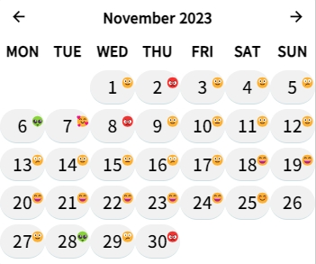

# Trilium-DailyMood
Browse daily moods in the calendar.

# Installation
1. Create a new code note named "dailyMood" in your Trilium note library, with the type set as "JS Frontend", and set the attribute `#run=frontendStartup` for this note.
2. Copy the code from [dailyMood.js](dailyMood.js) in the repository and paste it into your newly created dailyMood note.
3. Restart Trilium frontend (press F5 or restart).

# Usage
Just add the `#todayMood=x` tag in your daily diary, where `x` is an integer value ranging from 0 to 10.

> Tip: You can add the `#label:todayMood=promoted,single,number` tag in your diary template to automatically generate the `#todayMood` tag in your daily diary.